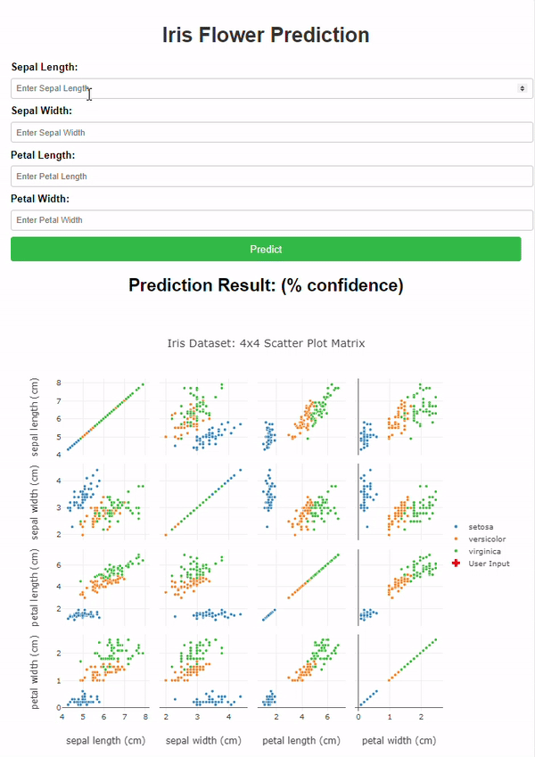

# Iris Flower Prediction App

This project is a web application that predicts the species of an Iris flower based on user input and visualizes the dataset using a scatter plot matrix. The app is built with Flask, Plotly, and scikit-learn.

## Demo



## Features

- Predict the Iris flower species using a pre-trained machine learning model.
- Visualize the dataset in a 4x4 scatter plot matrix.
- Highlight user input on the scatter plot matrix with the prediction.

## Prerequisites

- Python 3.x
- Flask
- scikit-learn
- Plotly

## Installation

1. **Clone the repository:**

    ```bash
    git clone https://github.com/samanseifi/iriswebapp.git
    cd iriswebapp
    ```

2. **Create a virtual environment (optional but recommended):**

    ```bash
    python3 -m venv venv
    source venv/bin/activate  # On Windows: venv\Scripts\activate
    ```

3. **Install the dependencies:**

    ```bash
    pip install -r requirements.txt
    ```

## Setup

1. **Train and save the model (if not already saved):**

    Run the following script to train the model and save it as `model.pkl`:

    ```python
    from sklearn.datasets import load_iris
    from sklearn.model_selection import train_test_split
    from sklearn.ensemble import RandomForestClassifier
    import pickle

    # Load the dataset
    data = load_iris()
    X = data.data
    y = data.target

    # Train the model
    X_train, X_test, y_train, y_test = train_test_split(X, y, test_size=0.2, random_state=42)
    model = RandomForestClassifier()
    model.fit(X_train, y_train)

    # Save the model
    with open('model.pkl', 'wb') as file:
        pickle.dump(model, file)

    print("Model saved as model.pkl")
    ```

2. **Run the Flask app:**

    ```bash
    python3 app_iris.py
    ```

3. **Access the application:**

    Open your browser and go to `http://127.0.0.1:5000` to use the app.

## Usage

- Enter the values for sepal length, sepal width, petal length, and petal width.
- Click "Predict" to get the predicted Iris flower species.
- The user input will be highlighted in red across all scatter plots in the scatter plot matrix.

## License

This project is licensed under the MIT License - see the [LICENSE](LICENSE) file for details.